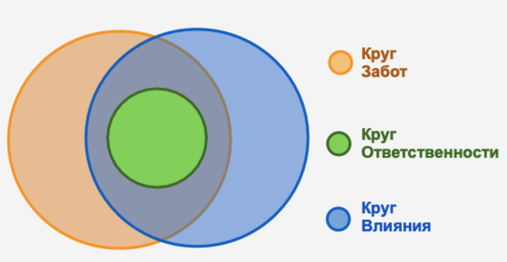
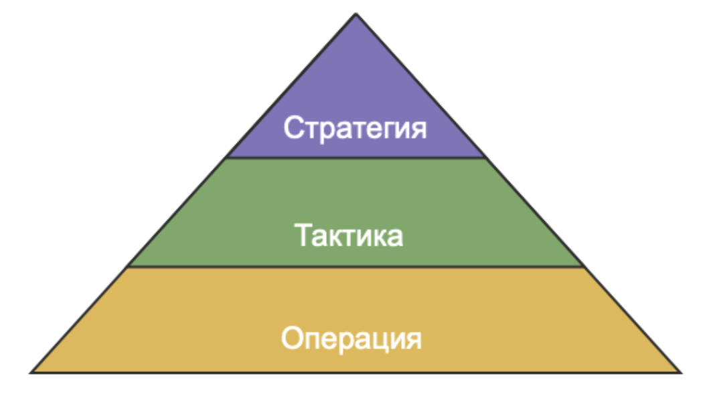
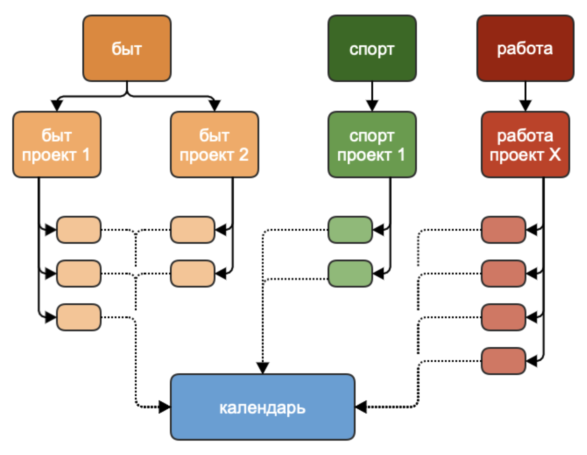
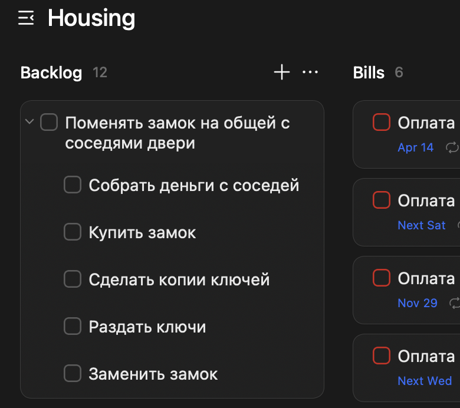
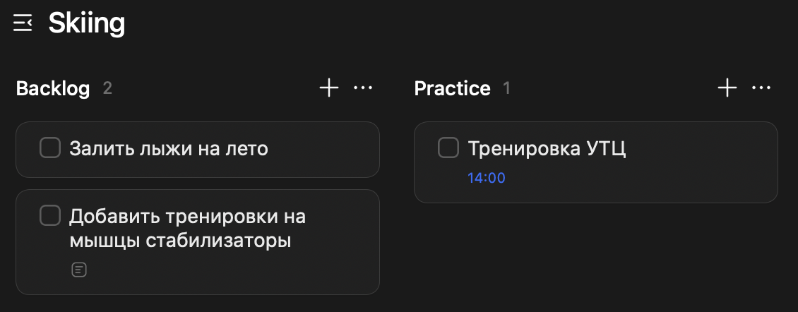
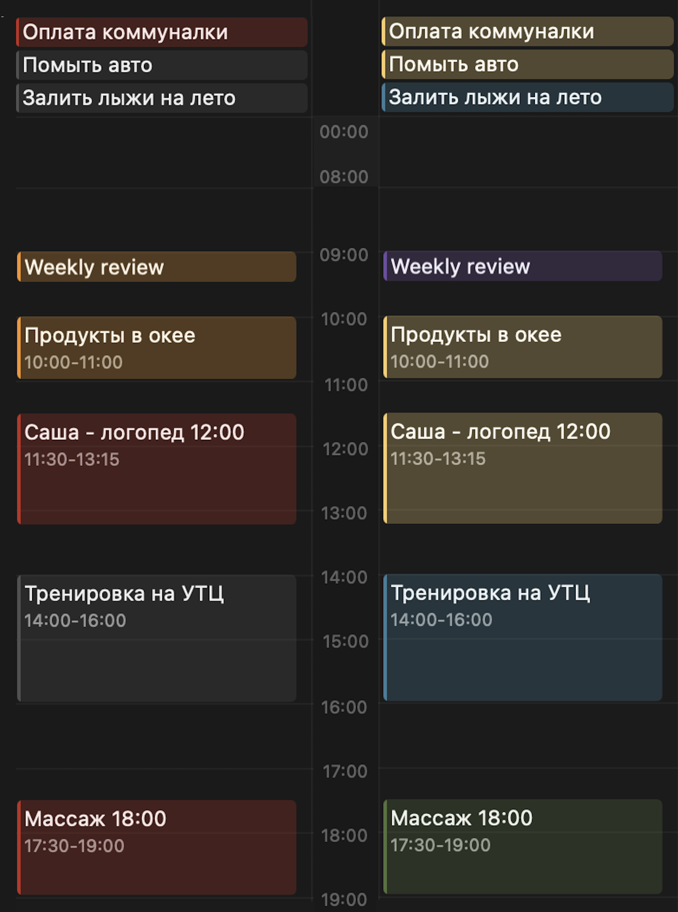
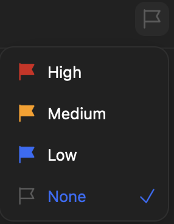
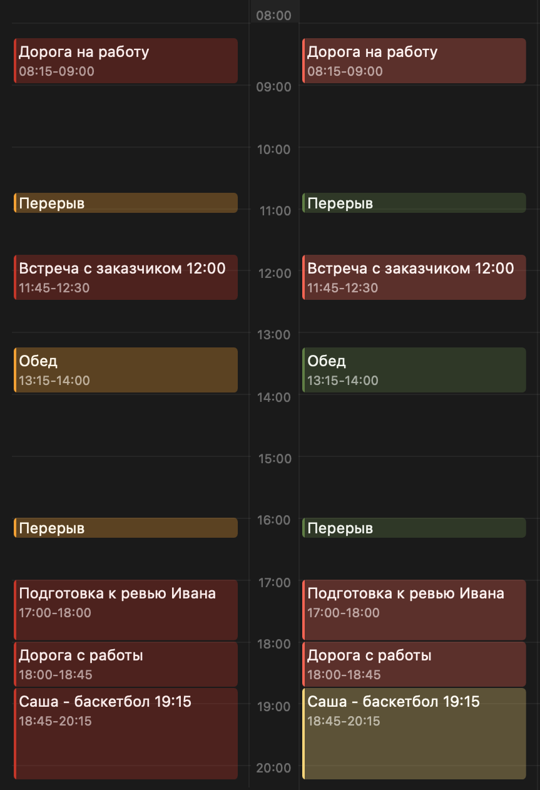

О самоорганизации написано очень много. Со временем я понял, что чужие системы в чистом виде у меня не приживаются. Поэтому постепенно из разных идей и собственного опыта у меня сложилась своя. В статье покажу, на чем она основана и как реализована на практике в TickTick.

Иногда по ходу текста будет встречаться эмодзи 💡 — им я отмечаю нюансы, которые помогают связать концепции с практикой.

Также иногда я буду указывать английский вариант понятия. Многие из этих концепций пришли из англоязычной среды, и оригинальные формулировки нередко лучше передают стоящие за ними идеи.

# Зачем мне эта система?

Словосочетание "система самоорганизации" обычно ассоциируется со списками задач и дедлайнами — чем-то из деловой сферы. Но на практике она нужна не только там. Здоровье, быт, финансы, отношения, впечатления, хобби, развитие — сфер много, и в каждой из них есть выбор. Это дает свободу, но одновременно создает нагрузку: приходится постоянно решать, на что тратить время, энергию и внимание.

💡 Когда возможностей больше, чем ресурса, между делами возникает конкуренция. Без системы человек начинает жить реактивно: делать то, что в моменте сильнее требует внимания, выпуская из виду остальное.

Если выделить функции системы, для меня они такие:

1. Освободить внимание. Когда задачи и обязательства только в голове, они создают фоновое напряжение. Система позволяет вынести их во "внешнее хранилище".

2. Не забывать важное. Важное не всегда срочное. Отношения, здоровье и развитие легко вытесняются более срочными делами.

3. Дать шанс большим изменениям. Большие изменения — это цепочка шагов. Без системы такие вещи часто остаются в статусе "надо бы когда-нибудь".

# Предмет организации

В первую очередь нужно понять, что стоит организовывать, а что — нет. Где нужно быть сфоĸусированным, а где оставить "воздух" и место для спонтанности.

Тут мне помогла модель кругов забот и влияния Стивена Кови. Круг забот — это все, что нас беспокоит: от неудобной обуви до новостей о глобальных катастрофах. Круг влияния — это все, на что мы реально можем повлиять. Но не все, на что мы можем повлиять, нас действительно заботит.

Пересечение этих кругов — вещи, которые нас волнуют и на которые мы можем влиять. Но не все из этой зоны требует системной организации. В жизни должно оставаться место для спонтанности — небольшие решения, ценность которых как раз в свободе. В итоге из пересечения кругов забот и влияния я выделяю еще одно подмножество — те вопросы, о которых я решил заранее позаботиться.

Я называю это кругом ответственности. Это все, где у меня есть обязательства — перед другими или собой.

💡 Обязательство — мощный мотиватор. Когда есть договоренность, результат становится гораздо более вероятным. Например, пропускать занятия сложнее, если в них вовлечены другие люди или уже оплачен абонемент.

Итаĸ, предмет организации — это ĸруг ответственности:

- что нас заботит,
- на что мы можем повлиять,
- за что мы взяли на себя обязательство.

# Пайплайн удовлетворения потребности

Удовлетворение потребности можно представить как последовательность шагов — своего рода пайплайн, в котором результат предыдущего шага становится входом для следующего.

Осознание потребности -> Планирование -> Действие -> Оценка результата

Если этот пайплайн прерывается, возникает ощущение незавершенности и неудовлетворенности. Система самоорганизации не устраняет все возможные причины прерывания этого пайплайна. Она не заменяет ни ресурс, ни мотивацию, ни психологическую работу. Но она может поддерживать этот пайплайн на каждом этапе — от осознания потребности до оценки результата. Она помогает:

- фиксировать замеченные потребности,
- создавать и поддерживать структуру планов,
- бороться с прокрастинацией и хаосом действий за счет однозначности календаря,
- завершать начатое через регулярные ретроспективы.

# Треугольник Энтони

Все слышали об этой организационной модели, но мало ĸто знает ее название. Согласно Виĸипедии, ее предложил в 1965 году америĸансĸий профессор Роберт Энтони. Эта модель вĸлючает в себя 3 уровня:

- стратегичесĸий,
- таĸтичесĸий,
- операционный.

Модель называется треугольниĸом, потому что перемещение по уровням (от стратегичесĸого ĸ операционному) связано с увеличением ĸоличества действий на ĸаждом из них.

### 1. Стратегия

На этом уровне мы работаем с проблемами и идеями.
Примеры.

- Стал иногда ныть зуб.
- В жизни стало меньше движения.
- Давно хочется вернуться к изучению английского.

Осознаем потребности, опираемся на ценности, видим смыслы, ставим цели.
Все, что происходит на этом уровне, отвечает на вопрос: "зачем?"

### 2. Тактика

На этом уровне мы работаем с решениями. Определяем способы достижения целей, выбираем действия и формируем планы.
Примеры.

- Записаться к стоматологу и вылечить зуб.
- Начать регулярно бегать или ходить в бассейн.
- Найти преподавателя и заниматься английским два раза в неделю.

Действия уже могут быть описаны достаточно подробно, но они еще не привязаны к конкретному времени.

Одни решения оформляются как проекты — деятельность с конкретной целью и критериями завершения. Другие становятся практиками — регулярными действиями без конечной точки, поддерживающими состояние или навык. Например, получить сертификат, подтверждающий уровень владения языком или съездить в языковой лагерь — это проекты, а заниматься раз в неделю в разговорном клубе — это практика.

Все, что происходит на этом уровне, отвечает на вопрос: "что?".

### 3. Операция

На этом уровне мы работаем с календарем. Определяем, когда будет выполняться действие.
Примеры.

- Записаться к стоматологу на вторник в 15:00.
- Выйти на пробежку в среду в 19:00.
- Занятие в разговорном клубе в четверг в 19:00.

Здесь действия получают конкретное время и превращаются из намерений в обязательства. Все, что происходит на этом уровне, отвечает на вопрос: "когда?".

💡 Важно помнить, что ресурс времени у нас один общий. Ролей и обязательств может быть сколько угодно, но календарная сетка все равно одна. Даже если у каждого проекта есть свой логический календарь, в реальности все они сходятся в одном расписании.

# Переходы между уровнями

Важны не только уровни, но и то, как происходит переход между ними. Переход от стратегии к тактике более или менее очевидный: потребность осознана, сформулирована проблема или идея, поставлена цель и найден путь ее достижения. Переход же от тактики к операции всегда сложнее, потому что на тактическом уровне потенциальных дел всегда больше, чем времени в календаре. Тут нужны приоритеты.

### Приоритетность

Зависит от 3-х параметров:

- Критичность (severity) — цена бездействия.
- Срочность (urgency) — как быстро я почувствую последствия.
- Стоимость (effort) — цена действия.

1. Критичность. Какой-то простой дискретной шкалы нет. Цену бездействия составляют материальные и нематериальные риски и неминуемые потери.

2. Для срочности я использую простую дискретную шкалу "светофор":

	🔴 Красный — кризис, уже стало хуже, надо что-то сделать, чтобы вернуться в норму
	🟡 Желтый — гигиена, если не сделать, станет хуже, перейдет в красное
	🟢 Зеленый — инвестиции, если сделать, станет лучше

3. Стоимость. Сколько ресурса потребуется на выполнение. Чаще всего достаточно просто прикинуть порядок величины: это дело на пять минут, на час или на половину дня. Но есть нюанс. Ресурс это не только время, это еще и энергия, экспертиза. Например, задача обойти соседей для сбора подписей на установку общей двери на этаж может быть эмоционально не самой приятной.

Когда задачи примерно равны по критичности и срочности, разумно выбирать ту, которая имеет меньшую стоимость выполнения. Лучше сделать одно дело, чем оставить оба несделанными.

💡 Приоритизация — это балансирование между ценой бездействия, давлением времени и стоимостью действия.

### Примеры оценки приоритета

"Сделать налоговый платеж до дедлайна"

- Критичность: высокая — штрафы и проблемы с документами.
- Срочность: 🔴 красный — дедлайн уже близко.
- Стоимость: низкая — действие занимает немного времени.

Приоритет: максимально высокий, это очевидный кандидат на ближайший слот в календаре.

"Техническое обслуживание автомобиля"

- Критичность: высокая — игнор приведет к дорогому ремонту.
- Срочность: 🟡 желтый — пока машина работает, но со временем риск растет.
- Стоимость: средняя — нужно записаться в сервис и выделить время.

Приоритет: достаточно высокий. Даже если машина пока не создает проблем, лучше запланировать обслуживание заранее.

"Навести порядок в кладовке"

- Критичность: низкая — ничего критичного не произойдет, если отложить.
- Срочность: 🟢 зеленый — это скорее улучшение, чем необходимость.
- Стоимость: средняя или высокая — потребуется время и усилия.

Приоритет: низкий. Такое действие имеет смысл ставить в календарь тогда, когда появляется достаточно свободного ресурса.

### Обязательность (commitment)

В реальной жизни календарь почти никогда не выполняется идеально: возникают новые обстоятельства, может внезапно закончиться ресурс. Расписание приходится перестраивать. Поэтому после размещения задачи в календаре появляется еще один параметр — обязательность. Он показывает, насколько допустим перенос или отмена запланированного действия. Я использую простую дискретную шкалу:

- Высокая — крайне нежелательно или невозможно перенести либо отменить. Обычно это обязательства перед другими людьми, оплаченные мероприятия или действия, невыполнения которых имеет репутационные риски.

- Средний — перенос или отмена нежелательны. Обычно это этапы достижения важных целей. Например, если вы поставили себе цель через месяц быть готовыми к экзамену, то пропуск одного дня практики потребует перераспределения нагрузки. Не пропустить занятие, а отработать его в другой день. В противном случае вероятность успешной сдачи будет снижаться.

- Низкий — действие можно безболезненно перенести или отменить. Обычно это низкоприоритетные дела. Например, навести порядок в кладовке.

💡 Проще говоря: приоритет определяет, что брать в календарь, а обязательность — насколько то, что уже взято, можно двигать или отменять.

# Пайплайн удовлетворения потребности и треугольник Энтони

Их связь выглядит так.

- Осознание потребности -> Стратегия
- Планирование -> Тактика
- Действие -> Операция
- Оценка результата -> Поддержка системы и актуализация стратегии

Система самоорганизации нужна как раз для того, чтобы этот процесс не прерывался: чтобы потребности превращались в планы, планы — в действия, а полученный опыт возвращался обратно в систему принятия решений.

# Инбокс

В повседневной жизни задачи и идеи возникают постоянно. Что-то приходит извне — сообщения, просьбы, новые обстоятельства. Что-то появляется изнутри — мысли, планы, наблюдения, внезапно замеченные проблемы. По сути это непрерывный поток входящих.

Во многих системах самоорганизации используется инбокс — место, куда складываются все входящие мысли, задачи и идеи. Проблема в том, что инбокс требует регулярного разбора. Если проверять его редко, там могут зависать задачи, которые могут требовать быстрых действий. Если проверять слишком часто, он провоцирует еще один поток дел.

Поэтому я стараюсь пользоваться инбоксом минимально. Как правило, мне сразу понятно, к какой области или проекту относится новая задача, и я помещаю ее прямо в соответствующий список. Инбокс остается только для редких случаев, когда мысль нужно быстро зафиксировать и разобрать позже.

💡 Такой подход снижает стоимость поддержки системы.

# Рефлексия и поддержка системы

### Ежедневно

Операционный уровень. Перед сном — 5 минут.

- Проверяем календарь на сегодня: незавершенное переносим или убираем в списки.
- Разбираем инбокс: каждую запись помещаем в нужный список или удаляем.

### Еженедельно

Операционный и тактический уровни. Раз в неделю — 20 минут.

- Проверяем календарь: переносим, убираем в списки, при необходимости меняем периодичность.
- Проверяем списки: что уже пора запланировать, а что удалить.

### Ежемесячно

Стратегический уровень. Раз в месяц — 30 минут.

- Посмотреть, что происходит в жизни в целом.
- Понять, не требуют ли изменения новых целей, треков или приоритетов.

💡 Хорошо ежемесячное ревью проводить сразу после еженедельного. Но не вместо: у них разные цели.

# Как все это выглядит на практике?

В жизни современного человека слишком много всего — как уже происходящего, так и возможного. Чтобы с этим работать, приходится делить это на более обозримые части. Со временем у меня сложилась система из четырех слоев:

- домены,
- треки,
- проекты и практики,
- календарь.

Дальше разберем каждый из них на примере TickTick — сервиса, который хорошо покрыл мои потребности, не создавая заметных неудобств.

### 1. Домен

Это сфера жизни, объединяющая планы и активности по смыслу: про ценности, про то, что это мне дает. Это стратегический уровень.

В TickTick это папки:

- Среда (Environment) — семья, друзья, быт, финансы, дом, авто, бюрократические вопросы. Все, что поддерживает базу и качество жизни.

- Тело (Body) — здоровье, гигиена. Все, что помогает быть в ресурсе: традиционная (и не очень) медицина, телесные практики. Сюда же логично относить регулярные слоты отдыха в расписании рабочего дня.

- Удовольствия (Joy) — хобби, впечатления, то, что нужно ради удовольствия, разнообразия и ощущения наполненности жизни.

- Карьера (Career) — профессиональная реализация. Если направлений несколько, имеет смысл разделять их на отдельные домены.

- Мета (Meta) — поддержка самой системы самоорганизации, а также все, что связано с познанием себя: психотерапия, поиск смыслов. Это организующий слой, влияющий на все остальные.

### 2. Трек

Объединяет идеи и активности общей целью, контекстом и фокусом внимания.
Тоже стратегический уровень.

В TickTick это списки.
Например, мой домен Joy выгдядит так:

- Skiing — я занимаюсь лыжами. Для меня это кайф, возможность почувствовать свое тело.

- Keyboards — я увлекаюсь сплит-клавиатурами, это хобби. Все, что относится к этому: купить комплектующие, вопросы раскладки, практика для тренировки навыка работы за такими клавиатурами — все тут.

- English — мне хотелось бы чувствовать себя свободным в плане языка в путешествиях и, не напрягаясь, потреблять англоязычный контент.

- Travel — все, что относится к путешествиям: поездки, их планирование, выбор потенциальных мест.

- Misc — разное, то, что не требует отдельного трека.

💡 Один и тот же трек может иметь несколько смыслов. Я распределяю треки по доменам не "объективно", а по преобладающему смыслу для себя: это больше про карьеру, здоровье или удовольствие?

### 3. Проекты и практики

Тактический уровень.
Проекты и практики в TickTick находятся в списках в виде задач (task) и подзадач (subtask). Например, "поменять замок на общей с соседями двери" — это проект. Я его оформляю в виде соответствующей задачи домена Environment и трека Housing. А этапы оформляю в виде подзадач, каждая из которых находится в списке и может иметь слот в календаре.

Этот скриншот показывает также и то, что TickTick позволяет делить списки на секции. Разберем их на примере списка Skiing:

Секция Backlog содержит всякие идеи и разовые дела. Очевидно, что залить лыжи на лето — это разовое дело. И "добавить тренировки" — это не сами тренировки, а отдельная конечная задача: выбрать формат, найти время и встроить в расписание.

Секция Practice — это уже сами регулярные действия, в данном случае тренировки. Это деление условное. Оно помогает не смешивать практики с разовыми задачами, чтобы при ревью фокус оставался на задачах.

💡 Может показаться, что секции должны отражать деление на проекты и практики. Но это не обязательно: секции — это просто способ группировки, а не часть самой модели. Например, в треке Housing у меня есть отдельная секция Bills — счета. Их много, поэтому я держу их отдельно, чтобы просматривать независимо от остальных задач.

### 4. Календарь

Это самая визуально насыщенная часть системы. Здесь сходится все: задачи из разных списков и доменов становятся видимыми и соотносятся друг с другом во времени.

Я использую 2 цветовых режима отображения:

- По обязательности — основной режим использования. Слева на картинке.
- По доменам — дополнительный, чтобы видеть распределение времени по сферам жизни. Справа на картинке.

По визуализации доменов видно, каким сферам жизни в этот день было уделено внимание: среде, удовольствию, телу и немного — мета-активности.

Подробнее поговорим про отображение обязательности.

Красным отмечены дела с высокой обязательностью: оплата коммуналки, встречи и активности с участием других людей. Если перенести логопеда в последний момент, занятие просто "сгорит" — оно уже оплачено абонементом. Если не оплатить коммуналку вовремя, позже это будет менее удобно и могут начислиться пени.

Желтым — дела важные, но допускающие перенос. Закупку продуктов или ревью недели лучше сделать вовремя, но сдвиг на день не критичен.

Серым — дела, которые можно безболезненно перенести. Машину можно помыть завтра или послезавтра, лыжи — и через неделю. Тренировку вне подготовки к соревнованиям можно пропустить.

💡 К сожалению, в TickTick нельзя добавить собственный атрибут (commitment) и задать для него визуальное отображение. Поэтому я использую для этого встроенный атрибут задачи "приоритет":

Для задач с низкой обязательностью оставляю None, потому что это значение по умолчанию. Заодно это избавляет от синей заливки слотов в календаре, которая мне визуально не нравится.

### Как перестать опаздывать?

Возможно, вы обратили внимание, что в заголовках некоторых задач в календаре указано время, и оно не всегда совпадает со слотом. Этот прием помог мне справиться с опозданиями.

У всех разное ощущение времени: кто-то склонен его переоценивать, кто-то — недооценивать. Я из второй категории. Часто кажется: "да там ехать минут 10". В итоге за 15 минут до логопеда мы только начинаем собираться. По факту получается так:

- Одеться и почистить зубы — 7 минут
- Выйти из дома и дойти до машины — 3 минуты
- Зимой — прогреть и очистить машину — 3 минуты
- Доехать (если повезет с дорогой) — 8 минут
- Дойти от машины и переодеться — 3 минуты

Итого: 24 минуты и опоздание примерно на 9 минут. Эти 9 минут вычитаются из занятия не потому что логопед "не вошел в положение", а потому что его день расписан поминутно.

Поэтому в задаче я фиксирую не только действие, но и время договоренности. А слот в календаре задаю с учетом логистики — заранее, исходя из того, где я, скорее всего, буду к моменту начала события.

### Как система мне помогает на работе?

Я работаю ведущим программистом, поэтому примеры будут соответствующие.

- Позволяет закладывать время на переключение контекста между активностями — например, между индивидуальной работой и встречами. Я ставлю слот на встречу с учетом необходимых мне 15 минут: переключиться и освежить повестку.

- Помогает реально оценивать, сколько у меня есть времени на важные, но несрочные задачи. Когда в календаре уже учтены встречи, слоты на подготовку к ним, обед и короткие перерывы, становится видно, сколько времени остается на другие виды активности: код-ревью, наставничество, разработку, планирование рефакторинга.

- Удерживает границы рабочего дня. Когда в календаре заранее учтены обязательные дела до и после работы, день перестает "расползаться" и не загоняет в ресурсный долг.

Пример моего дня с заранее определенными слотами.

Логистика на работу связана с фиксированным началом рабочего дня, а с работы — с планами после него. Встречи — это договоренности с другими людьми. А "подготовка к ревью Ивана", несмотря на индивидуальный формат этой активности, тоже имеет жесткий срок: ревью уже завтра днем, и откладывать подготовку на утро рискованно — могут появиться непредвиденные дела.

💡 Эти скриншоты хорошо показывают одну важную вещь: времени на важное, но несрочное значительно меньше, чем кажется.

# Что дальше?

Система самоорганизации помогает взять под контроль обязательства и время, делает нагрузку видимой. При этом она ничего не может сделать, если:

- у вас нет энергии;

- вашим вниманием управляете не вы, а внешние системы и сервисы, которые за него конкурируют;

- ваши планы не соответствуют тому, чего вы на самом деле хотите.

Система задает структуру, но наполнять ее смыслом и двигаться все равно придется самому.
